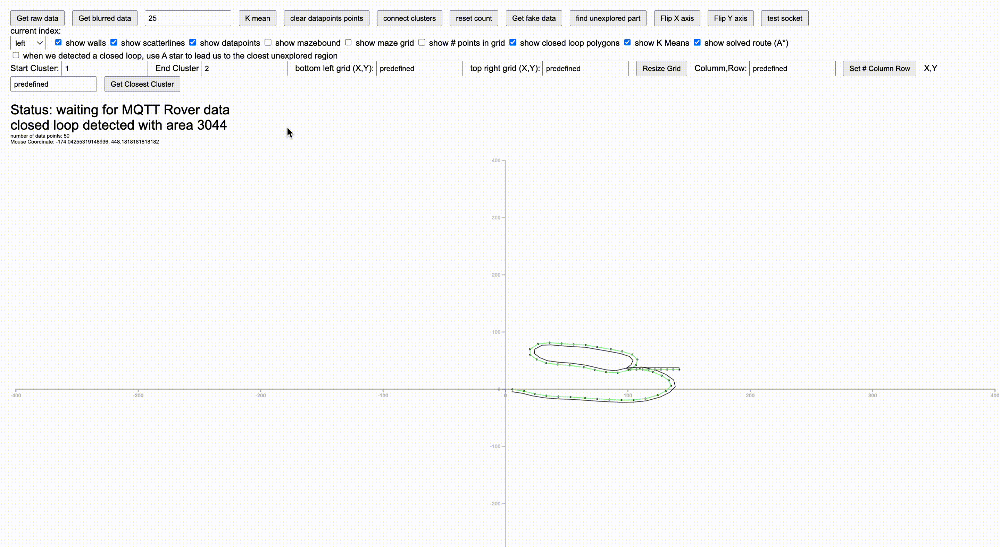
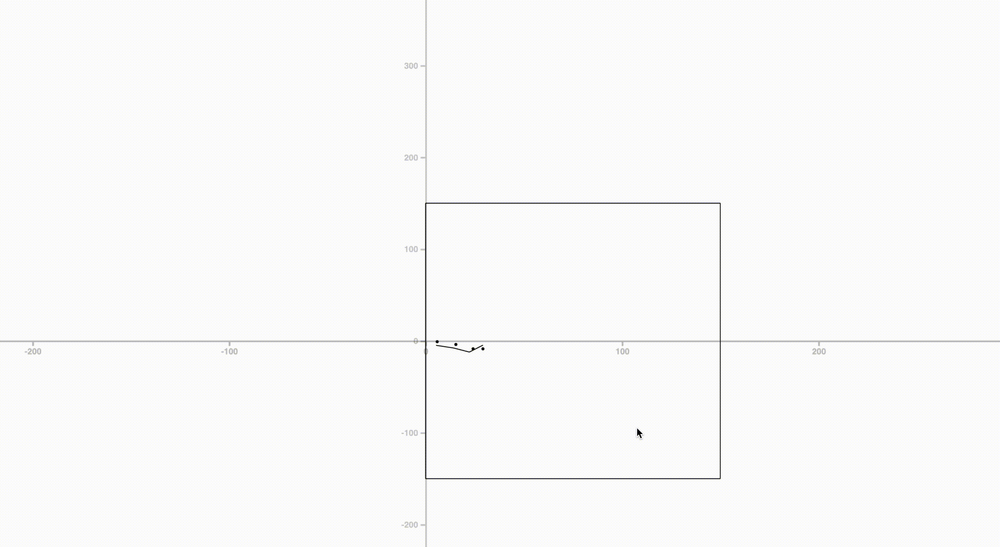

# Real-Time Maze Mapper & Routing with K-Means Clustering & A* Star Path Finder

A project made for Imperial College Year 2 Electronic & Information Engineering End of Year Project:
[Balance Bug](https://github.com/jieunboy0516/BalanceBugEYPyr2)


## Table of Contents

1. [Overview](#overview)
   - [Frontend UI](#frontend-ui)
   - [Scatter](#scatter)
   - [Wall Plotting (estimation with geometry)](#wall-plotting-estimation-with-geometry)
   - [K Means Clustering](#k-means-clustering)
   - [Clusters Connection](#clusters-connection)
   - [A* PathFinding](#a-pathfinding)
   - [Autonomous A* PathFinding to explored area](#autonomous-a-pathfinding-to-explored-area)
   - [Closed Loop Detection](#closed-loop-detection)
2. [Rover Position Simulation](#rover-position-simulation)
3. [Other Features](#other-features)
4. [Future Implementation](#future-implementation)


## Overview

Short Demonstration of the Balance Bug EOY project

[](https://www.youtube.com/watch?v=3lt04PQoKZM)

### Frontend UI:


Graphical Representation of a Maze built upon [D3JS](https://d3js.org/), a library for data visualization. Path of a maze is drawn given data points collected from the rover. The rover performs continuous exploration and sends its X,Y coordinates on the maze to the Mapper. Different features are included onto the UI to perform advanced Mapping and Routing.

### Scatter 

The data points which represent rover position is plotting in scatter format where I also draw a green line to connect the scatter so that a path can be visualized.

### Wall Plotting (estimation with geometry)
Since in our project, the rover's exploration strategy is based on following maze's wall, this UI includes a feature which utilize geometry to estimate the wall position. In the following video, the black path represents the wall. It can be seen that the wall is generated next to the data points with a tunable WallMargin variable to adust the distance between the path and the wall.


### K Means Clustering

Since there will be a lot of data point sent from the Rover, it is extremely inefficient to perform PathFinding algorithms on all the data points. Therefore, K Means Clustering technique is chosen to perform data points Interpolation and Sampling. Currently, it is set that 0.4 * the number of the data points of K Means Clusters will be generated for the interpolation process. For example, 10000 data points will be represented by 4000 K Means Clusters in an accurate and efficient way. This allows PathFinding Algorithm, in our case, A* Routing algo, to be performed quickly. 

The K mean clusters are represented in orange color.



### Clusters Connection

After performing Clustering, in order to perform path finding algorithm to route from 1 point to 1 point, we need to present the whole maze's paths as connected clusters, and 1 cluster should connect to more than 1  cluster in the case of junctions. Eg, when there is a junction which allows turning left and right, the cluster at the junction should be connected to the left and the right cluster too. This is done by the `connectclusters` function in my code which loops through all the position data points and connect the clusters accordingly. The graph of clusters structure is represented like this:

```
{
    A: [B,C] //which means cluster A is attached to B & C
    C: [D], //C is connected to D
    D: [C]  // D is connected to C
}
```

and each cluster(K means centroid) has coordinates represented like:

```
{
    A: [1,2]    //cluster A at coordinates (1,2)
}
```

Note: As you can see, the C and D representation is redundant. This can be improved by a better clusters connection algorithm.


### A* PathFinding

Once we performed K Means Clustering, we can choose to implement A* Path finding strategy on 2 arbitrary clusters. Details of A* path finding theory is not explained here.


### Autonomous A* PathFinding to explored area

In our mapping strategy (which can be referred in our project repo), we aim to explore the map entirely and therefore we split the maze into MxN grids cells and determine if each cell is explored. With this representation, I am able to perform A* Pathfinding strategy continuously when a closed loop is detected (details in the main repo). 


### Closed Loop Detection

As said, our strategy to maze mapping requires closed loop detection. This is done by analyzing the data points to see if a data point has reached a point where it has visited before. Notable point is that I performed Closed Loop Area Calculation here with `d3.polygonarea` to calculate the area of the closed loop accurately. This is done to identify unreachable closed loops efficiently. 




## Rover Position Simulation

Since we were not always in the lab to perform testing on the maze, I build a simulation feature which allows the data points to be added by the keyboard arrow keys to simulate the rover movement. I also added the option to select which wall is being followed (left, right or none).


### Other Features

There are few other features implemented but will not be described here, which includes adding 'unreachable data point' with keyboard presses. It is done because not all the points in the maze region can be explored so I allowed adding 'unreachable data points' manually. Note: the unreachable data points usually present in closed loop unreachable areas.


## Future Implementation

During the project development, I considered using a Deep Reinforcement Learning algorithm to solve the maze rather than using A*. But it was not implemented due to time constraints but may be implemented in a future personal project for demonstration purpose.

The benefit of using DRL (deep RL) is that DRL can be used to perform path finding on the data points directly instead of the clusters so that the route found by DRL will be much likely to be shorter due to being able to "cut corners" more efficiently and accurately. Also, DRL utilizes Neural Network which can operate in a maze with a much higher complexity than the one in this EoY project.